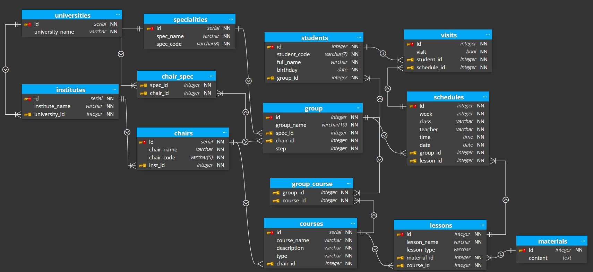

#  Spring Data JPA Multiple Databases

### Databases used

* PostgreSQL
* Spring Data Redis 
* Spring Data Elasticsearch
* Spring Data MongoDB
* Spring Data Neo4j

### Logical schema

### Splitting tables into multiple databases

* PostgreSQL includes: all tables
* Redis includes: 'students'
* Elasticsearch includes: 'materials'
* MongoDB includes: 'universities', 'institutes' and 'chairs'
* Neo4j includes: all tables without 'materials' and 'visits'